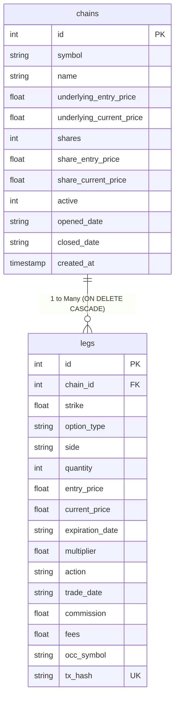

# Options Chain Controller Database Documentation (`DATABASE_README.md`)

The Options Chain Controller application uses an **SQLite database (`options_chains.db`)** to persist multi-leg options strategies, position headers, transaction records, SHA-256 deduplication fingerprints (`tx_hash`), and active/closed lifecycle states.

---

## Database Architecture Overview

- **Engine**: SQLite 3
- **File**: [`options_chains.db`](file:///Users/olegbushmelev/Projects/chain_controller/options_chains.db)
- **Integrity Constraints**: `FOREIGN KEY (chain_id) REFERENCES chains (id) ON DELETE CASCADE`
- **Deduplication Index**: `CREATE UNIQUE INDEX idx_legs_tx_hash ON legs(tx_hash) WHERE tx_hash IS NOT NULL`
- **ORM / Interface**: [`options_chain/storage.py`](file:///Users/olegbushmelev/Projects/chain_controller/options_chain/storage.py)

---

## Transaction Deduplication (`tx_hash`)

To prevent duplicate entries when importing broker Activity reports repeatedly (`python main.py import-sources`), each imported transaction leg generates a deterministic **SHA-256 fingerprint**:

$$\text{tx\_hash} = \text{SHA256}(\text{trade\_date} \mid \text{occ\_symbol} \mid \text{action} \mid \text{quantity} \mid \text{entry\_price} \mid \text{commission} \mid \text{fees})$$

Before inserting any leg into SQLite, the import engine queries `idx_legs_tx_hash`. Existing hashes are skipped automatically as duplicates.

---

## Table Schemas

### 1. `chains` Table
Stores header information, active status, opening/closing dates, and underlying asset metadata for each options strategy/chain.

| Column | Data Type | Description |
| :--- | :--- | :--- |
| `id` | `INTEGER` | Primary key (auto-incrementing unique chain ID) |
| `symbol` | `TEXT` | Ticker symbol of the underlying asset (e.g. `IBM`, `AAPL`, `SPY`) |
| `name` | `TEXT` | Name of the strategy (e.g. `IBM 2026-07-24 Chain`) |
| `underlying_entry_price` | `REAL` | Reference price of the underlying stock when opened |
| `underlying_current_price` | `REAL` | Current market price of the underlying stock |
| `shares` | `INTEGER` | Quantity of underlying stock shares held (default `0`) |
| `share_entry_price` | `REAL` | Entry cost basis per stock share (default `0.0`) |
| `share_current_price` | `REAL` | Current price per stock share (default `0.0`) |
| `active` | `INTEGER` | `1` (`True`) for active open chains, `0` (`False`) for closed chains |
| `opened_date` | `TEXT` | ISO date string (e.g. `2026-07-14`) when first opening trade occurred |
| `closed_date` | `TEXT` | ISO date string (e.g. `2026-07-16`) when chain was fully closed (`NULL` for active) |
| `deleted` | `INTEGER` | `1` for soft-deleted chains, `0` for active/closed (default `0`) |
| `created_at` | `TIMESTAMP` | Record creation timestamp (defaults to `CURRENT_TIMESTAMP`) |

#### SQL DDL Statement:
```sql
CREATE TABLE chains (
    id INTEGER PRIMARY KEY AUTOINCREMENT,
    symbol TEXT NOT NULL,
    name TEXT,
    underlying_entry_price REAL,
    underlying_current_price REAL,
    shares INTEGER DEFAULT 0,
    share_entry_price REAL DEFAULT 0.0,
    share_current_price REAL DEFAULT 0.0,
    active INTEGER DEFAULT 1,
    opened_date TEXT,
    closed_date TEXT,
    deleted INTEGER DEFAULT 0,
    created_at TIMESTAMP DEFAULT CURRENT_TIMESTAMP
);
```

---

### 2. `legs` Table
Stores each individual option transaction/position belonging to an options chain.

| Column | Data Type | Description |
| :--- | :--- | :--- |
| `id` | `INTEGER` | Primary key for the leg record |
| `chain_id` | `INTEGER` | **Foreign Key** pointing to `chains(id)` (`ON DELETE CASCADE`) |
| `strike` | `REAL` | Option strike price (e.g. `200.0`) |
| `option_type` | `TEXT` | `CALL` or `PUT` |
| `side` | `TEXT` | `BUY` (Long position) or `SELL` (Short position) |
| `quantity` | `INTEGER` | Number of contracts (e.g. `1`, `5`) |
| `entry_price` | `REAL` | Premium paid or received per share at entry (e.g. `$3.80`) |
| `current_price` | `REAL` | Current market price/premium per share |
| `expiration_date` | `TEXT` | Expiration date string (e.g. `2026-07-24`) |
| `multiplier` | `REAL` | Contract multiplier (default `100.0` per contract) |
| `action` | `TEXT` | Transaction action: `SELL_TO_OPEN`, `BUY_TO_OPEN`, `BUY_TO_CLOSE`, `SELL_TO_CLOSE` |
| `trade_date` | `TEXT` | ISO transaction date string (e.g. `2026-07-14`) |
| `commission` | `REAL` | Broker commission paid (e.g. `0.65`) |
| `fees` | `REAL` | Regulatory/exchange fees paid (e.g. `0.01`) |
| `occ_symbol` | `TEXT` | Standard 21-character OCC option symbol (e.g. `IBM260724P200`) |
| `tx_hash` | `TEXT` | **Unique SHA-256 fingerprint** for deduplication |
| `deleted` | `INTEGER` | `1` for soft-deleted legs, `0` for active/closed (default `0`) |

#### SQL DDL Statement:
```sql
CREATE TABLE legs (
    id INTEGER PRIMARY KEY AUTOINCREMENT,
    chain_id INTEGER NOT NULL,
    strike REAL NOT NULL,
    option_type TEXT NOT NULL,
    side TEXT NOT NULL,
    quantity INTEGER NOT NULL,
    entry_price REAL NOT NULL,
    current_price REAL,
    expiration_date TEXT,
    multiplier REAL DEFAULT 100.0,
    action TEXT,
    trade_date TEXT,
    commission REAL DEFAULT 0.0,
    fees REAL DEFAULT 0.0,
    occ_symbol TEXT,
    tx_hash TEXT,
    deleted INTEGER DEFAULT 0,
    FOREIGN KEY (chain_id) REFERENCES chains (id) ON DELETE CASCADE
);

CREATE UNIQUE INDEX IF NOT EXISTS idx_legs_tx_hash ON legs(tx_hash) WHERE tx_hash IS NOT NULL;
```

---

## Entity Relationship Diagram


