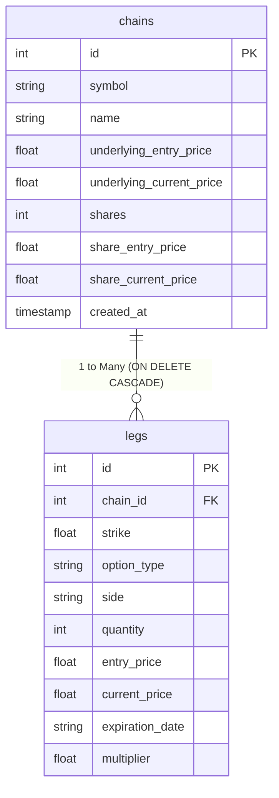

# Options Chain Controller Database Documentation (`DATABASE_README.md`)

The Options Chain Controller application uses an **SQLite database (`options_chains.db`)** to persist multi-leg options strategies, position headers, and contract legs.

---

## Database Architecture Overview

- **Engine**: SQLite 3
- **File**: [`options_chains.db`](file:///Users/olegbushmelev/Projects/chain_controller/options_chains.db)
- **Integrity Constraints**: `FOREIGN KEY (chain_id) REFERENCES chains (id) ON DELETE CASCADE`
- **ORM / Interface**: [`options_chain/storage.py`](file:///Users/olegbushmelev/Projects/chain_controller/options_chain/storage.py)

---

## Table Schemas

### 1. `chains` Table
Stores header information and underlying asset metadata for each options strategy/chain.

| Column | Data Type | Description |
| :--- | :--- | :--- |
| `id` | `INTEGER` | Primary key (auto-incrementing unique chain ID) |
| `symbol` | `TEXT` | Ticker symbol of the underlying asset (e.g. `AAPL`, `SPY`, `TSLA`) |
| `name` | `TEXT` | Name of the strategy (e.g. `AAPL Bull Call Spread`) |
| `underlying_entry_price` | `REAL` | Reference price of the underlying stock when the chain was opened |
| `underlying_current_price` | `REAL` | Current market price of the underlying stock |
| `shares` | `INTEGER` | Quantity of underlying stock shares held (default `0`) |
| `share_entry_price` | `REAL` | Entry cost basis per stock share (default `0.0`) |
| `share_current_price` | `REAL` | Current price per stock share (default `0.0`) |
| `created_at` | `TIMESTAMP` | Record creation timestamp (defaults to `CURRENT_TIMESTAMP`) |

#### SQL DDL Statement:
```sql
CREATE TABLE chains (
    id INTEGER PRIMARY KEY AUTOINCREMENT,
    symbol TEXT NOT NULL,
    name TEXT,
    underlying_entry_price REAL,
    underlying_current_price REAL,
    shares INTEGER DEFAULT 0,
    share_entry_price REAL DEFAULT 0.0,
    share_current_price REAL DEFAULT 0.0,
    created_at TIMESTAMP DEFAULT CURRENT_TIMESTAMP
);
```

---

### 2. `legs` Table
Stores each individual option position (call or put, bought or sold) belonging to an options chain.

| Column | Data Type | Description |
| :--- | :--- | :--- |
| `id` | `INTEGER` | Primary key for the leg record |
| `chain_id` | `INTEGER` | **Foreign Key** pointing to `chains(id)` (`ON DELETE CASCADE`) |
| `strike` | `REAL` | Option strike price (e.g. `150.0`) |
| `option_type` | `TEXT` | `CALL` or `PUT` |
| `side` | `TEXT` | `BUY` (Long position) or `SELL` (Short position) |
| `quantity` | `INTEGER` | Number of contracts (e.g. `1`, `5`, `10`) |
| `entry_price` | `REAL` | Premium paid or received per share at entry (e.g. `$5.00`) |
| `current_price` | `REAL` | Current market price/premium per share |
| `expiration_date` | `TEXT` | Expiration date string (e.g. `2026-08-21`) |
| `multiplier` | `REAL` | Contract multiplier (default `100.0` per contract) |

#### SQL DDL Statement:
```sql
CREATE TABLE legs (
    id INTEGER PRIMARY KEY AUTOINCREMENT,
    chain_id INTEGER NOT NULL,
    strike REAL NOT NULL,
    option_type TEXT NOT NULL,
    side TEXT NOT NULL,
    quantity INTEGER NOT NULL,
    entry_price REAL NOT NULL,
    current_price REAL,
    expiration_date TEXT,
    multiplier REAL DEFAULT 100.0,
    FOREIGN KEY (chain_id) REFERENCES chains (id) ON DELETE CASCADE
);
```

---

## Entity Relationship Diagram



---

## Sample SQL Queries

### Query All Saved Chains with Leg Counts
```sql
SELECT c.id, c.symbol, c.name, COUNT(l.id) AS leg_count, c.created_at
FROM chains c
LEFT JOIN legs l ON c.id = l.chain_id
GROUP BY c.id
ORDER BY c.created_at DESC;
```

### Query All Legs for a Specific Chain
```sql
SELECT side, quantity, option_type, strike, entry_price, current_price, multiplier
FROM legs
WHERE chain_id = 1;
```
